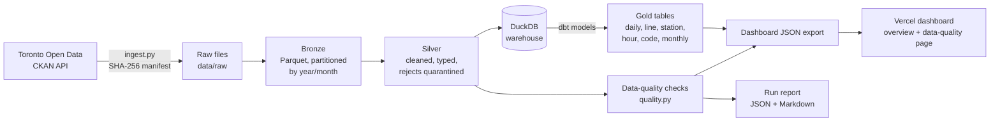

# Toronto Transit Data Platform

Live data-quality-checked view of Toronto subway delays, from an open pipeline anyone can rerun.

**Live dashboard:** https://toronto-transit-data-platform.vercel.app

Code: this repository. Data: TTC Subway Delay Data from
[Toronto Open Data](https://open.toronto.ca/dataset/ttc-subway-delay-data/),
ingested through the CKAN API into bronze/silver/gold layers (Parquet +
DuckDB), modeled with dbt, checked on every run, and published to the
dashboard above with its data-quality report attached.

**Design reasoning:** [DESIGN.md](DESIGN.md) · **Latest run report:** [docs/latest_run.md](docs/latest_run.md)

## Why this exists

I build data pipelines for a living (Data Orchestration Specialist,
Manulife, Toronto; Honours Mathematics, University of Waterloo). This project
is my public, runnable version of how I think pipelines should behave.

The rule it is built around: **a credible-looking wrong number is worse than
no number.** So the messy parts of the source data are handled in the open:

- The raw `Line` field contains values like `YU/ BD`, `LINE 2 - BLOOR DANFORTH`,
  and even bus route numbers inside a subway file. They map to explicit
  `MULTI_LINE_OR_NETWORK` / `UNKNOWN` buckets with the raw value preserved.
  They are never guessed into a line total.
- The `Station` field is free text: **1,489 distinct values** for a subway
  with roughly 75 stations, most of them one-off location notes. The platform
  reports that, with a dedicated data-quality check, instead of pretending a
  clean station dimension exists.
- The published delay-code reference file is double-encoded UTF-8; silver
  repairs the mojibake and a unit test pins the behaviour.
- 64.9% of incident records have a recorded delay of **0 minutes**, so gold
  models report *average delay when delayed* alongside counts. A plain
  average would quietly understate passenger impact.

## What the data says (verified run, 2026-09-30)

All figures below come from the pipeline run whose report is in
`docs/latest_run.md`; nothing is hand-typed from the source files.

| | |
|---|---|
| Coverage | 2024-01-01 to 2026-08-31 |
| Bronze rows | 71,942 (2024 XLSX: 26,467 · 2025+ CSV: 45,475) |
| Silver rows | 71,856 (86 exact duplicates removed, 0 quarantined) |
| Total recorded delay | 196,314 minutes |
| Data-quality checks | 10/10 passed |
| Worst line by delay minutes | Line 1 (Yonge–University): 107,858 min across 37,255 incidents |
| Worst station by delay minutes | Eglinton Station: 6,138 min |
| Most frequent delay code | SUDP "Disorderly Patron": 8,587 incidents, 20,704 delay minutes |
| Peak delay hour | 16:00 (11,917 delay minutes) |

## Architecture



## Run it locally

```bash
./scripts/run_local.sh          # venv, install, tests, full pipeline
# or, step by step:
python3 -m venv .venv && . .venv/bin/activate
pip install -e ".[dev]"
pytest -q                       # 17 tests
python -m ttc_platform.run_pipeline
cd dashboard && npm install && npm run dev
```

The pipeline is idempotent: ingestion skips files whose SHA-256 matches the
manifest, and the transforms are deterministic rebuilds, so re-running cannot
double-count.

## Layout

```
src/ttc_platform/   ingest.py · transform.py · quality.py (adapter) · run_pipeline.py · config.py
src/honest_checks/  standalone data-quality checker package (own README, CLI, config format)
dbt/                dbt-duckdb project: 6 gold models + sources.yml
tests/              pytest unit tests over transform logic + DQ checks (small fixture)
dashboard/          Vite + Chart.js app reading public/data/dashboard.json
docs/               latest_run.md (generated) · github-actions-workflow.yml.txt
data/               gitignored: raw / bronze / silver / gold / reports / warehouse.duckdb
```

## Data quality, and `honest_checks`

Ten checks run on every pipeline execution (schema conformance, timestamp
parse rate, station null rate, negative delays, code-reference coverage,
duplicate rate, canonical-line rate, station long-tail rate, freshness,
volume anomaly vs trailing 6-month mean). Results are emitted as JSON +
Markdown and rendered on the dashboard's Data quality page. A failed check
stays visible; it does not get quietly edited away.

The checker itself is a standalone package, [`src/honest_checks`](src/honest_checks/README.md):
its own directory, its own public API and CLI (`python -m honest_checks
--input <parquet|csv|duckdb> --config checks.json`), and no imports from
the rest of the pipeline, so it can be spun out as its own project
unchanged. It runs against any dataset you can load into a DataFrame;
expectations live in a JSON config whose format is documented in its
README. This project only adds a thin adapter (`src/ttc_platform/quality.py`)
that translates TTC-specific thresholds into that config.

## Limitations, honestly

- Scope is 2024 through Aug 2026, not the full 2014+ history. Older years are
  the same schema in separate XLSX files; adding them is a config change,
  documented in DESIGN.md.
- Freshness is bounded by the publisher: the source updates monthly, so the
  freshness check allows 45 days.
- Gold is a full rebuild, not incremental. At ~72k rows that is the correct
  trade-off; DESIGN.md explains where incremental models would slot in.
- Station-level analysis inherits the source's free-text station field. The
  leaderboard is dominated by consistently-named major stations, but the
  long tail is location notes, not stations.

## What production would add

An orchestrator (Dagster/Airflow) with retries and backfills, the GitHub
Actions workflow shipped in `docs/github-actions-workflow.yml.txt` (the
automation account cannot write `.github/workflows/` directly, so it is
committed as documentation for a one-time manual add), alerting on failed
DQ checks, dbt tests beside the Python DQ suite, and a managed warehouse
instead of a local DuckDB file. Details in [DESIGN.md](DESIGN.md).

## Source and licence of the data

Data: Toronto Open Data, *TTC Subway Delay Data*, published under the
Open Government Licence – Toronto. This repository contains code and small
aggregated outputs only; the raw data is re-downloaded from the source on
every run and is not redistributed here.
